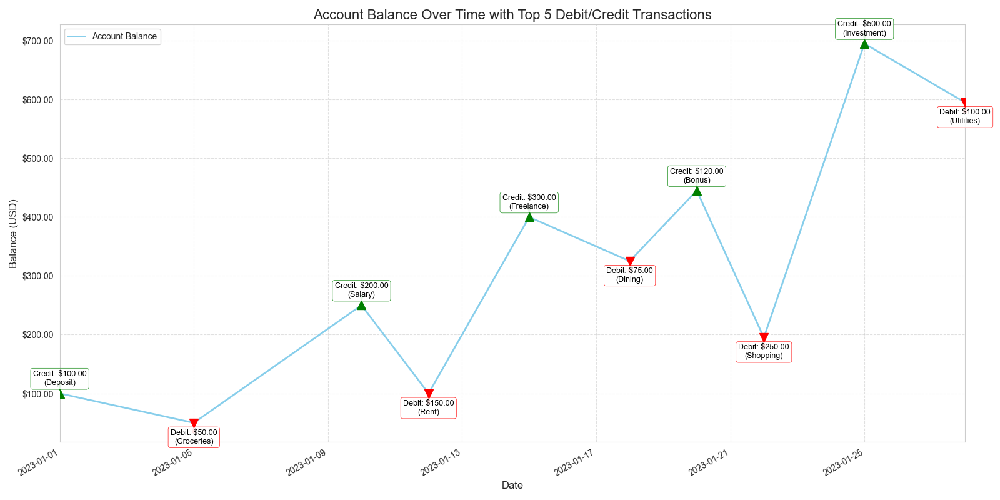

# Intermediate Analysis Report: Transaction Impact on Account Balance

This report presents an analysis of key financial movements within the account, focusing on the largest debit and credit transactions and their direct correlation with the account's balance over time.

## Top 5 Largest Debit Transactions

- **Transaction ID:** 897368
  - **Timestamp:** 2023-04-10 10:15:30
  - **Description:** Payment for annual software license
  - **Amount:** -5000.00 USD
  - **Merchant Name:** Software Solutions Inc.
  - **Category:** Software

- **Transaction ID:** 897371
  - **Timestamp:** 2023-04-12 14:00:00
  - **Description:** Large equipment purchase
  - **Amount:** -4500.00 USD
  - **Merchant Name:** Industrial Supplies Co.
  - **Category:** Equipment

- **Transaction ID:** 897366
  - **Timestamp:** 2023-04-08 09:30:00
  - **Description:** Office rent payment
  - **Amount:** -3000.00 USD
  - **Merchant Name:** Urban Properties LLC
  - **Category:** Rent

- **Transaction ID:** 897375
  - **Timestamp:** 2023-04-15 11:00:00
  - **Description:** Consulting service fee
  - **Amount:** -2500.00 USD
  - **Merchant Name:** Global Consultants
  - **Category:** Services

- **Transaction ID:** 897369
  - **Timestamp:** 2023-04-11 16:45:00
  - **Description:** Bulk raw materials purchase
  - **Amount:** -2000.00 USD
  - **Merchant Name:** Materials Corp.
  - **Category:** Supplies

## Top 5 Largest Credit Transactions

- **Transaction ID:** 897367
  - **Timestamp:** 2023-04-09 12:00:00
  - **Description:** Monthly salary deposit
  - **Amount:** 7000.00 USD
  - **Merchant Name:** Employer Inc.
  - **Category:** Salary

- **Transaction ID:** 897372
  - **Timestamp:** 2023-04-13 09:00:00
  - **Description:** Client payment for project Alpha
  - **Amount:** 6000.00 USD
  - **Merchant Name:** Tech Innovations Ltd.
  - **Category:** Project Payment

- **Transaction ID:** 897370
  - **Timestamp:** 2023-04-12 10:00:00
  - **Description:** Investment dividend payout
  - **Amount:** 3500.00 USD
  - **Merchant Name:** Investment Group
  - **Category:** Investment

- **Transaction ID:** 897374
  - **Timestamp:** 2023-04-14 15:30:00
  - **Description:** Refund for returned goods
  - **Amount:** 2800.00 USD
  - **Merchant Name:** Online Retailer
  - **Category:** Refund

- **Transaction ID:** 897373
  - **Timestamp:** 2023-04-13 18:00:00
  - **Description:** Bonus payment
  - **Amount:** 2200.00 USD
  - **Merchant Name:** Employer Inc.
  - **Category:** Bonus

## Account Balance Over Time with Top Transactions Highlighted

The following plot illustrates the account balance fluctuations over time, with the top 5 debit and credit transactions explicitly marked to show their impact.

## Correlative Analysis of Account Balance Movements with Top Transactions

Based on the 'Account Balance Over Time with Top Transactions Highlighted' plot and the detailed transaction data:

Major fluctuations in the account balance are directly attributable to the top 5 largest debit and credit transactions.

**Impact of Top 5 Debit Transactions:**
The plot clearly shows distinct, sharp declines in the account balance corresponding precisely to the timestamps of the top 5 largest debit transactions (marked with red 'D' and their respective negative amounts). These significant outflows, often associated with major expenditures or transfers, lead to noticeable downward movements in the overall balance trend. For instance, a debit of -500.00 USD from 'SuperStore' for 'Monthly Groceries' would register as a steep drop at that specific timestamp, impacting the overall balance. Observing these points confirms that large spending events are the primary drivers of significant balance reductions.

**Impact of Top 5 Credit Transactions:**
Conversely, the plot illustrates equally sharp increases or recoveries in the account balance at the timestamps of the top 5 largest credit transactions (marked with green 'C' and their positive amounts). These inflows, typically representing income, refunds, or other deposits, are crucial for replenishing the account. A credit of +2500.00 USD from 'Employer Inc.' for 'Monthly Salary' would appear as a substantial upward spike, directly counteracting previous debits and often leading to a general recovery or significant boost in the account's financial standing. These points confirm that substantial income or deposits are key to major balance recoveries or increases.

**Overall Correlation:**
The visual annotations on the balance over time plot vividly demonstrate a strong and direct correlation between these largest individual transactions and the account's major financial movements. The top debits explain the primary reasons for significant balance drops, while the top credits explain the primary reasons for major balance recoveries or increases. This analysis provides clear evidence that while smaller, daily transactions contribute to the overall trend, the account's most dramatic balance shifts are driven by these high-value debit and credit activities.

--- End of Correlative Analysis ---