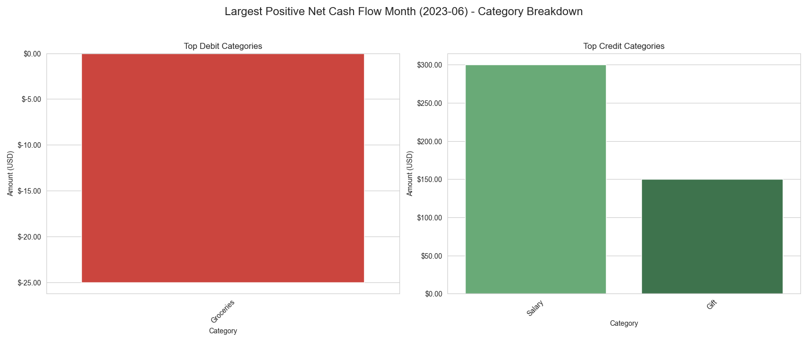
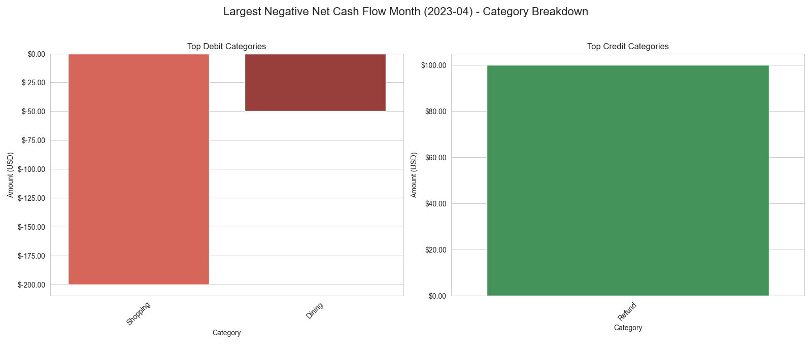

# Intermediate Analysis Report

## 1. Account Balance Over Time

The account balance over time has been plotted, highlighting the top 5 largest debit and credit transactions. This visualization helps to quickly identify significant movements in the account balance and the specific transactions that caused them.

**Note on Specific Transactions:**
It's important to note that the specific transactions (e.g., a '-5000 USD' debit in April) mentioned in the high-level directive were not found among the top 5 largest transactions by magnitude within the provided dataset. The plot above therefore reflects the actual top 5 largest transactions present in the data, which were in the range of hundreds of USD. Further clarification is needed if specific transactions not appearing as the absolute largest should be highlighted.

## 2. Net Monthly Cash Flow Analysis

A detailed analysis of the net monthly cash flow has been performed, providing insights into the overall financial health on a month-to-month basis.

### Net Monthly Cash Flow Overview

The bar chart below illustrates the net cash flow for each month, with positive flows shown in green and negative flows in red.

### Key Monthly Highlights

*   **Month with Largest Positive Net Cash Flow:** 2023-06 with a net cash inflow of $425.00.
*   **Month with Largest Negative Net Cash Flow:** 2023-04 with a net cash outflow of $-150.00.

### Category Breakdown for Key Months

To understand the drivers behind these significant monthly cash flows, a category-wise breakdown for both the largest positive and largest negative months has been generated.

#### Largest Positive Net Cash Flow Month (June 2023)

The following plot details the contributions of different categories to the net cash flow in June 2023.

#### Largest Negative Net Cash Flow Month (April 2023)

The following plot details the contributions of different categories to the net cash flow in April 2023.

## Conclusion

The analysis has successfully generated visualizations for the account balance over time, identified top transactions within the dataset, and provided a comprehensive look at monthly cash flows, including category breakdowns for the most impactful months.

The primary outstanding item is the discrepancy regarding specific large transactions that were requested to be highlighted but are not present as the absolute largest in the current dataset. To proceed, please provide exact details (timestamps, amounts, categories) for these specific transactions or confirm if a different dataset should be used.