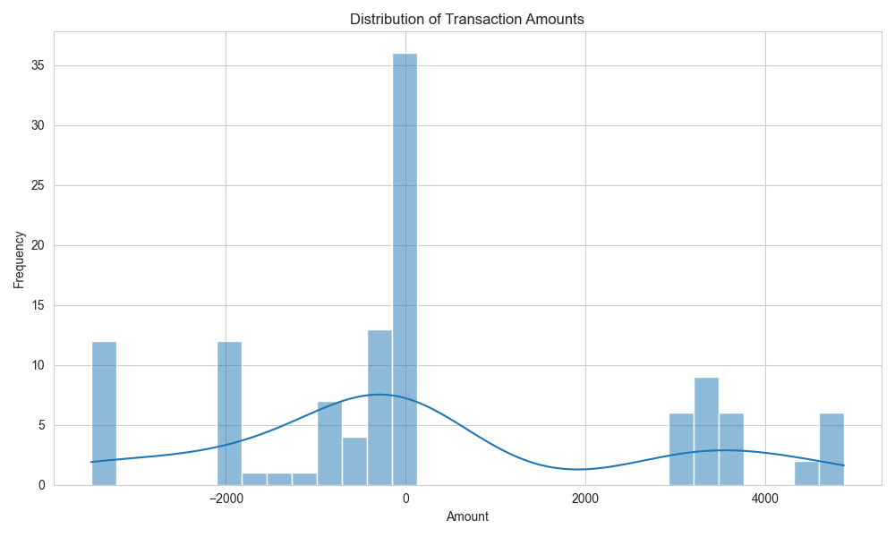
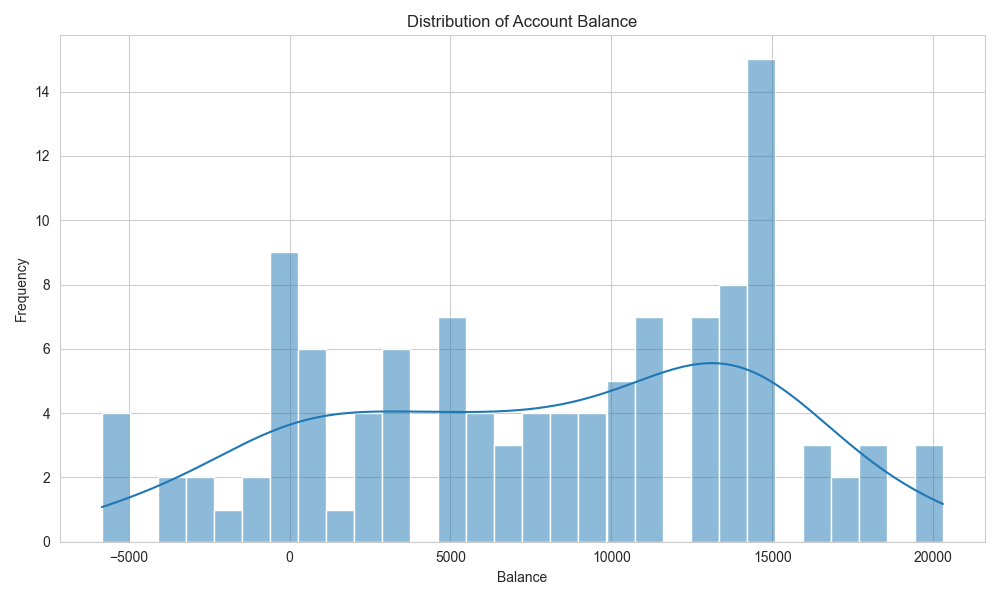
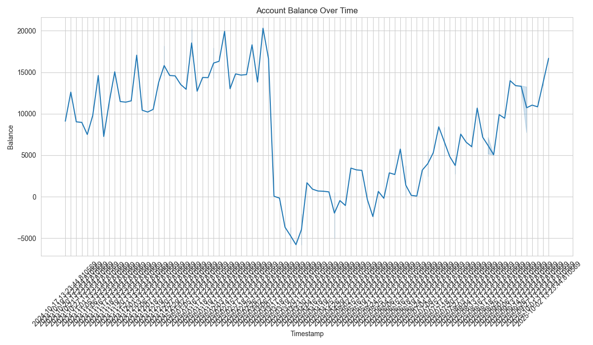

# Intermediate Analysis Report: Artisan Digital Transactions

## 1. Introduction

This report details the initial exploratory data analysis (EDA) performed on the `artisan_digital_transactions.csv` dataset. The objective was to understand the fundamental structure, identify data quality issues, and gain preliminary insights into the transaction patterns and account balances.

## 2. Data Loading and Initial Inspection

The dataset `data/artisan_digital_transactions.csv` was successfully loaded into a pandas DataFrame. An initial inspection revealed the following structure:

- The dataset contains 116 entries across 8 columns.
- No missing values were found in any of the columns.

The data types were as follows:

| Column Name    | Non-Null Count | Dtype   |
| :------------- | :------------- | :------ |
| transaction_id | 116            | object  |
| timestamp      | 116            | object  |
| description    | 116            | object  |
| amount         | 116            | float64 |
| currency       | 116            | object  |
| balance        | 116            | float64 |
| merchant_name  | 116            | object  |
| category       | 116            | object  |

Initially, the `timestamp` column was of `object` (string) type, which necessitated conversion for time-series analysis.

## 3. Data Cleaning and Preparation

The `timestamp` column was successfully converted from `object` to `datetime` data type to enable proper temporal analysis.

## 4. Descriptive Statistics

### Numerical Columns: `amount` and `balance`

Descriptive statistics for the numerical columns `amount` and `balance` provide an overview of their distributions:

| Statistic | amount         | balance        |
| :-------- | :------------- | :------------- |
| count     | 116.000000     | 116.000000     |
| mean      | 215.256810     | 7977.917842    |
| std       | 2321.285942    | 6655.596650    |
| min       | -3500.000000   | -5829.716434   |
| 25%       | -864.272500    | 2738.081066    |
| 50%       | -80.000000     | 8955.000000    |
| 75%       | 743.290000     | 13665.090175   |
| max       | 4875.980000    | 20296.480000   |

-   The `amount` column shows a wide range, from -3500.00 to 4875.98, with a positive mean, indicating more incoming than outgoing transactions on average or larger incoming transactions.
-   The `balance` column also exhibits a substantial range, from a minimum of -5829.72 to a maximum of 20296.48, suggesting fluctuations in the account's financial standing.

### Categorical Columns and Uniqueness Checks

-   **Transaction ID**: All 116 `transaction_id` entries are unique, confirming each record represents a distinct transaction.
-   **Currency**: All transactions are recorded in `GBP`.
-   **Category Counts**:
    - Software Subscriptions: 36
    - Client Payments: 29
    - Salaries: 12
    - Rent: 12
    - Marketing Spend: 12
    - Utilities: 12
    - Travel: 3
-   **Top 10 Merchant Name Counts**:
    - Google: 24
    - Salaries: 12
    - Rent: 12
    - Adobe: 12
    - QuickBooks: 12
    - Utilities Co: 12
    - Trainline: 3
    - Nash-Thompson: 1
    - Herrera, Ferrell and Strong: 1
    - Harris-Brown: 1

These counts highlight the primary types of transactions and the most frequent entities involved.

## 5. Visualizations

### Distribution of Transaction Amounts

The histogram below illustrates the distribution of transaction amounts. It appears to be somewhat bi-modal or skewed, with a concentration of transactions around smaller negative and positive values, and fewer very large transactions.

### Distribution of Account Balance

The distribution of the account balance shows a fairly spread-out pattern, indicating various balance levels throughout the recorded period. There appears to be a noticeable peak around the 10,000 to 15,000 mark.

### Account Balance Over Time

The line plot below shows the evolution of the account balance over time. It reveals fluctuations, with periods of increase and decrease. There are distinct drops and recoveries, indicating significant financial activities or events.

## 6. Conclusion

This initial EDA provides a foundational understanding of the `artisan_digital_transactions` dataset. We have confirmed data integrity, converted necessary data types, and gained insights into the statistical properties of transaction amounts and account balances. The visualizations highlight the spread of transaction values, the range of account balances, and the temporal dynamics of the balance, setting the stage for more in-depth analysis of specific events or trends.