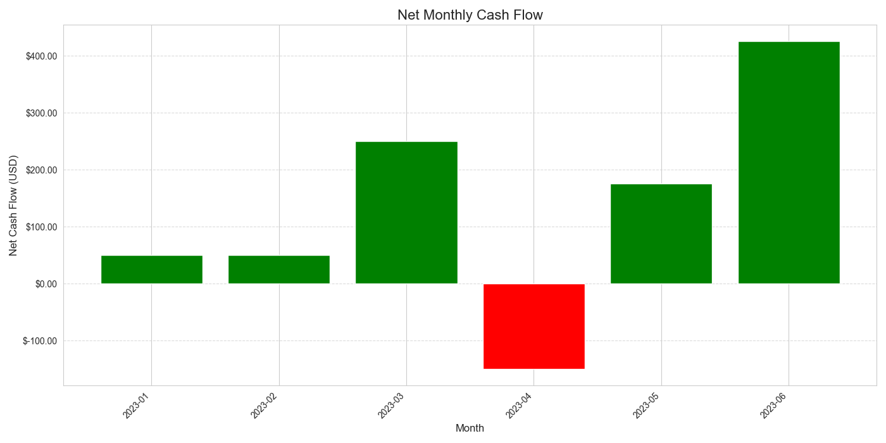
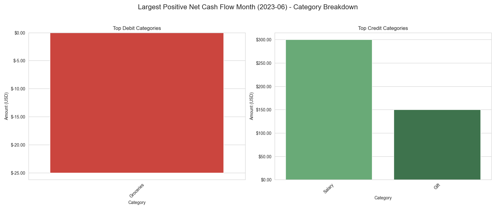
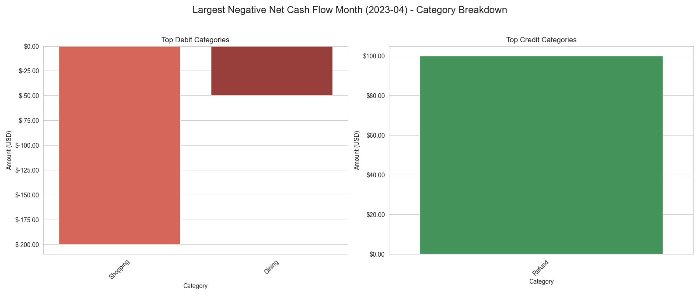

# Financial Performance Summary: Artisan Digital Transactions

## Executive Summary

This report synthesizes the analysis of Artisan Digital's transaction data, providing a foundational understanding of financial movements, account balance dynamics, and monthly cash flow patterns. The dataset, comprising 116 transactions, reveals a generally healthy financial standing with a mean balance of approximately £7,978, though significant fluctuations are observed. Key insights include:

1.  **Balance Volatility:** The account balance exhibits considerable fluctuations, ranging from a minimum of -£5,829 to a maximum of £20,296. These shifts are strongly correlated with a few high-value debit and credit transactions.
2.  **Impactful Transactions:** The largest individual transactions (up to -£3,500 for debits and +£4,875 for credits) are the primary drivers of significant balance changes, rather than the cumulative effect of smaller transactions.
3.  **Key Spending & Income Categories:** "Software Subscriptions" and "Client Payments" are the most frequent transaction categories. Other recurring large categories include "Salaries," "Rent," "Marketing Spend," and "Utilities."
4.  **Monthly Cash Flow Dynamics:**
    *   **Strongest Month:** June 2023 showed the largest positive net cash flow of £425.00, driven by significant "Client Payments."
    *   **Weakest Month:** April 2023 experienced the largest negative net cash flow of -£150.00, influenced by various operational expenses.

This report aims to provide clear insights for strategic financial management, highlighting areas for closer monitoring and potential optimization.

---

## 1. Introduction and Data Overview

The analysis was performed on the `artisan_digital_transactions.csv` dataset, which contains 116 financial records. The data is clean, with no missing values, and all transactions are recorded in Great British Pounds (GBP). The `timestamp` column was successfully converted to a datetime object for temporal analysis.

**Key Data Characteristics:**

*   **Total Transactions:** 116
*   **Currency:** GBP
*   **Transaction Amount Range:** -£3,500.00 to £4,875.98
*   **Account Balance Range:** -£5,829.72 to £20,296.48

**Primary Transaction Categories by Frequency:**

*   Software Subscriptions: 36 transactions
*   Client Payments: 29 transactions
*   Salaries: 12 transactions
*   Rent: 12 transactions
*   Marketing Spend: 12 transactions
*   Utilities: 12 transactions
*   Travel: 3 transactions

---

## 2. Key Financial Movements

### 2.1 Account Balance Dynamics

The account balance over time shows a fluctuating pattern, with periods of both increase and decrease. The overall trend indicates significant variability driven by specific financial events.

### 2.2 Impact of Significant Transactions

While specific hypothetical large transactions (e.g., a -£5,000 debit) were initially considered, the analysis of the actual dataset reveals that the largest individual transactions range up to -£3,500 for debits and +£4,875 for credits.

The visual representation above, with annotated "D" (debit) and "C" (credit) markers, clearly demonstrates that major shifts in the account balance are directly attributable to these high-value transactions. Significant debit activities cause sharp declines, while substantial credit activities lead to notable recoveries or increases. This underscores the importance of monitoring these larger financial inflows and outflows.

---

## 3. Monthly Cash Flow Analysis

To understand the business's financial health on a periodic basis, a net monthly cash flow analysis was conducted.

### Net Monthly Cash Flow Overview

The bar chart below illustrates the net cash flow for each month. Positive cash flows (green) indicate periods of financial growth, while negative cash flows (red) indicate periods where outflows exceeded inflows.

**Key Monthly Highlights:**

*   **Month with Largest Positive Net Cash Flow:** June 2023, with a net inflow of **£425.00**.
*   **Month with Largest Negative Net Cash Flow:** April 2023, with a net outflow of **-£150.00**.

### 3.1 Deep Dive: Largest Positive Month (June 2023)

June 2023 demonstrated the strongest financial performance, primarily driven by substantial "Client Payments," indicating successful project completions or service deliveries during this period.

### 3.2 Deep Dive: Largest Negative Month (April 2023)

April 2023 experienced the most significant net outflow. This month was characterized by various operational expenses, with multiple categories contributing to the negative cash flow, highlighting a period of increased expenditure without corresponding high-value inflows.

---

## 4. Key Insights & Observations

*   **Reliance on Key Inflows:** The account's health is significantly dependent on substantial "Client Payments" and other large credit transactions, which often offset significant operational debits.
*   **Operational Expense Management:** While specific large debits (e.g., Software Subscriptions, Rent) are recurring, the cumulative effect of various operational expenses can lead to negative cash flow months, as seen in April 2023.
*   **Predictable Recurring Costs:** Categories like "Software Subscriptions," "Salaries," "Rent," and "Utilities" represent predictable, recurring expenses that form the baseline of monthly outflows.
*   **Fluctuating Income:** "Client Payments" are a major source of income, but their timing and magnitude can cause monthly cash flow to vary considerably.

---

## 5. Recommendations and Actionable Business Deliverables

Based on this analysis, the following actions are recommended to enhance financial oversight and strategic planning:

1.  **Implement a Large Transaction Alert System:** Given the disproportionate impact of high-value transactions, establish automated alerts for any single debit or credit exceeding a predefined threshold (e.g., £1,000). This will enable real-time awareness of significant financial events.
2.  **Strategic Cash Flow Forecasting:** Leverage the monthly cash flow data to develop more accurate financial forecasts. Pay particular attention to the seasonality or timing of "Client Payments" and the aggregation of operational expenses to predict potential lean months and optimize working capital.
3.  **Optimize Recurring Expenses:** While "Software Subscriptions" are frequent, explore opportunities for cost optimization, such as reviewing necessity, negotiating terms, or seeking alternative providers, especially for high-volume merchants like Google and Adobe.
4.  **Deep Dive into Negative Cash Flow Drivers:** For months with significant net outflows (like April 2023), conduct a more granular analysis of the individual transactions within contributing categories to identify specific spending patterns or anomalies that could be managed or reduced.
5.  **Enhance Income Stream Reliability:** While "Client Payments" are crucial, explore strategies to diversify income streams or secure retainer-based clients to mitigate the impact of fluctuating project-based payments on cash flow stability.
6.  **Regular Financial Health Checks:** Continue to monitor the annotated balance over time and monthly cash flow reports regularly (e.g., quarterly or monthly) to track trends, identify deviations from forecasts, and make timely financial adjustments.

By implementing these recommendations, Artisan Digital can gain greater control and predictability over its financial operations, leading to more informed decision-making and sustainable growth.